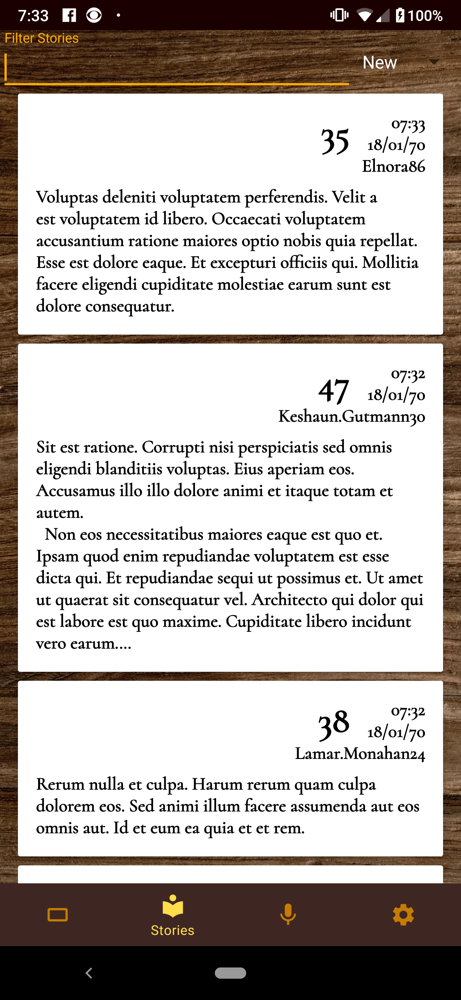
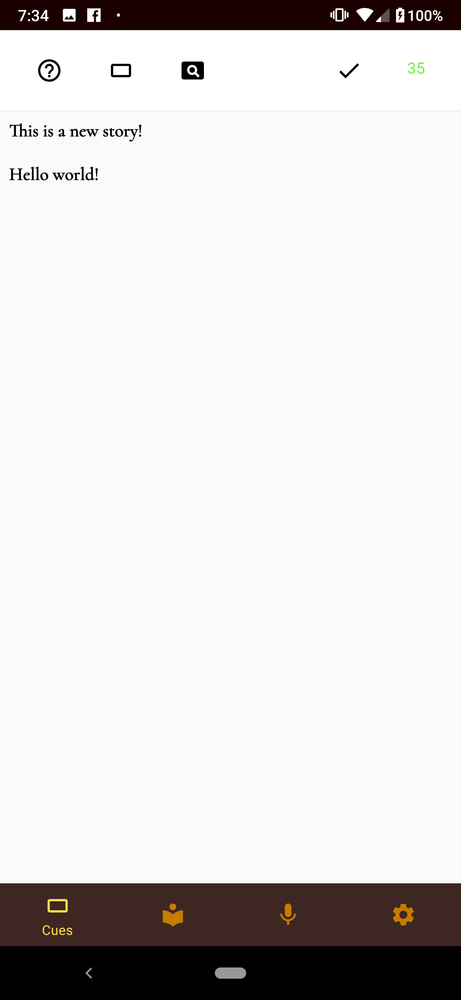

# Spark Stories

This is a toy app to explore the [JetPack Components](https://developer.android.com/jetpack), try new development flows, and get experience using services such as Firebase.

This app is similiar to [r/WritingPrompts](https://www.reddit.com/r/WritingPrompts/) but geared for mobile devcies. Users create 'Cues' which are the starting points for 'Stories'. Stories are capped at a character limit to force the stories to be short and concise. The idea is to give aspiring writers a platform to easily practice a little bit every day. It was also planned to add a narration feature to give a similiar service for voice actors, though this is yet to be implemented.

### Tools and Libraries Used
* Room Library for local Data persistence
* Paging Library with infinite scrolling from local storage + network
* Navigation Library
* Databinding Library
* Firebase authentication with OAuth supported for Google, Facebook, and Twitter
* Firestore backend
* Dagger2
* Jacoco
* SonarQube
* Mockk

This app was attempted to be created entirely through [Test Driven Development](https://en.wikipedia.org/wiki/Test-driven_development). I have found TDD on Android to be very difficult in the past and spent a lot of effort in this project trying new testing libraries and testing patterns. I used tools such as [Jacoco](https://github.com/jacoco/jacoco) and [SonarQube](https://www.sonarqube.org/) to help measure my test coverage and avoid code smells.
